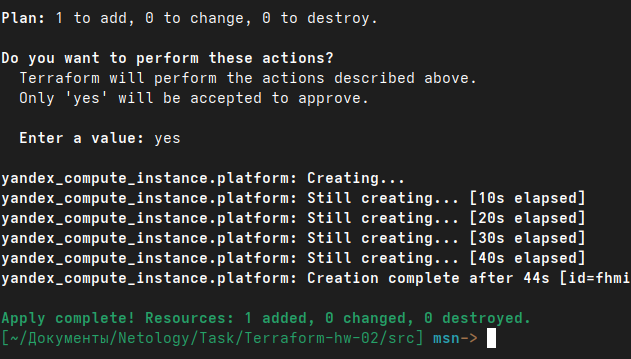
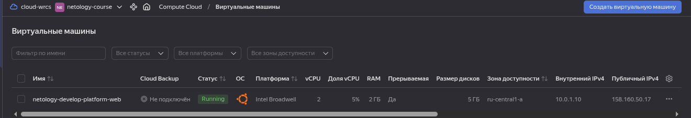
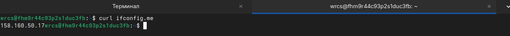
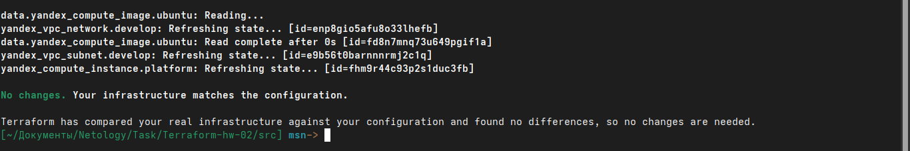
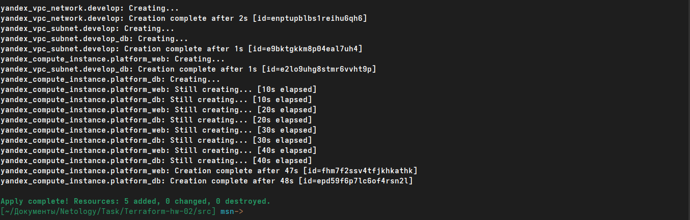
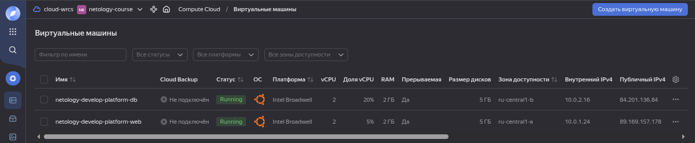
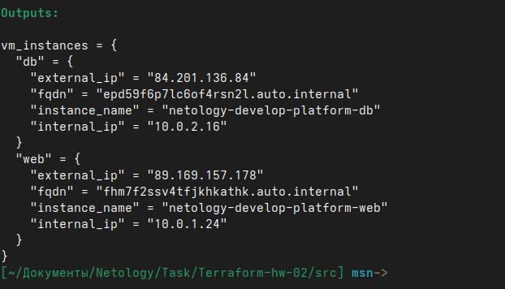
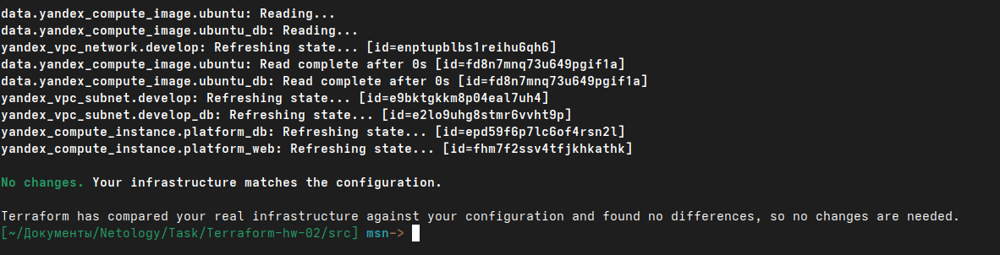

# Отчет по выполнению домашнего задания

## Задание 1: Создание базовой инфраструктуры

### Исправление ошибок в коде
- **Опечатка**: `standart-v4` → `standard-v1`
- **Переменная**: `vms_ssh_root_key` → `vms_ssh_public_root_key`
- **Добавлена закрывающая скобка** для `scheduling_policy`

### Исправление конфигурации ВМ
Изменили количество ядер с 1 на 2 для платформы `standard-v1`:

```terraform
web = {
  cores         = 2  # Было 1
  memory        = 2
  core_fraction = 5
}
```



### Проверка подключения

ВМ в личном кабинете YC


Подключились к ВМ и выполнили `curl ifconfig.me`:


### Ответ на вопрос о параметрах ВМ
**`preemptible = true` и `core_fraction=5`** полезны в обучении:
- `preemptible = true` - ВМ в 5 раз дешевле, но может прерываться
- `core_fraction = 5` - ограничивает CPU до 5%, снижая стоимость

Экономит бюджет при обучении и тестировании.

## Задание 2: Вынесение значений в переменные
Создали переменные с префиксом `vm_web_` в `variables.tf`



## Задание 3: Создание второй ВМ
Создали файл `vms_platform.tf` и добавили вторую ВМ `netology-develop-platform-db`





## Задание 4: Настройка outputs
Создали `outputs.tf` с информацией о ВМ:

```terraform
output "vm_instances" {
  description = "Information about created VM instances"
  value = {
    web = {
      instance_name = yandex_compute_instance.platform_web.name
      external_ip   = yandex_compute_instance.platform_web.network_interface[0].nat_ip_address
      internal_ip   = yandex_compute_instance.platform_web.network_interface[0].ip_address
      fqdn          = yandex_compute_instance.platform_web.fqdn
    }
    db = {
      instance_name = yandex_compute_instance.platform_db.name
      external_ip   = yandex_compute_instance.platform_db.network_interface[0].nat_ip_address
      internal_ip   = yandex_compute_instance.platform_db.network_interface[0].ip_address
      fqdn          = yandex_compute_instance.platform_db.fqdn
    }
  }
}
```



## Задание 5: Использование locals
Создали `locals.tf` с именами ВМ:

```terraform
locals {
  vm_web_name = "netology-develop-platform-web"
  vm_db_name  = "netology-develop-platform-db"
}
```



## Задание 6: Рефакторинг переменных
Объединили переменные в map-структуры:

```terraform
variable "vms_resources" {
  type = map(object({
    cores         = number
    memory        = number
    core_fraction = number
  }))
  default = {
    web = {
      cores         = 2
      memory        = 2
      core_fraction = 5
    }
    db = {
      cores         = 2
      memory        = 2
      core_fraction = 20
    }
  }
}

variable "metadata" {
  type = object({
    serial-port-enable = number
    ssh-keys           = string
  })
  default = {
    serial-port-enable = 1
    ssh-keys           = "wrcs:ssh-ed25519 AAAAC3Nza..."
  }
}
```

## Итоги
✅ Все задания выполнены  
✅ Инфраструктура создана в Yandex Cloud  
✅ Авторизация через сервисный аккаунт работает  
✅ Код отрефакторен согласно требованиям
